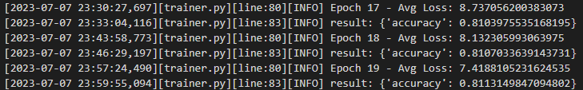

# BoolQ数据集上T5模型Prompt Tuning及其改进代码

本代码实现了在BoolQ数据集上，使用T5模型微调预测答案得功能。支持得微调主要包括：

1. Fine Tuning T5模型Decoder最后两层

2. Prompt Tuning，在输入前加入soft prompt：


3. Changed Prompt Tuning, Prompt Tuning的改进，考虑Prompt Tuning的初始化方法，输入出现在prompt中的token和prompt保持一致，结构如下：


## 参数

以下说明本程序中的部分参数：
```
model: 可选 t5-small, t5-base, t5-large
ft_way：微调方式，可选fine_tune, prompt
changed: 是否在prompt tuning基础上改进，为1为改进
init_class: 选择prompt tuning是prompt embedding的初始化方法
--log_file: 日志文件名称
```

## 运行代码

```
CUDA_VISIBLE_DEVICES=5 python main.py --model t5-small  --batch_size 16 --log_file log.txt \
--lr 5e-04 --prompt_len 100 --ft_way prompt --changed 0 --init class_label
```


## 结果

训练过程中部分结果截图：

使用t5-small:

使用t5-large:


#### 1. 在BoolQ数据集微调T5模型Decoder后两层，最终的结果

| 模型规模   | 初始 Acc. | 微调 Acc. | 微调参数量 |
|-----------|---------|---------|-----------|
| t5-small  | 60.67   | 61.50   | 8,391,680 |
| t5-base   | 72.63   | 75.23   | 18,878,976 |
| t5-large  | 58.69   | 80.76   | 33,560,576 |


#### 2. 在BoolQ数据集上T5模型使用Prompt Tuning微调
（1）固定prompt 长度为50， 使用不同的初始化方法微调的准确率（Accuracy）
| 初始化方法     | t5-small  | t5-base   | t5-large  |
|----------------|-----------|-----------|-----------|
| Random         | 62.51     | 64.89     | 77.31     |
| Random Vocab   | 64.83     | 73.11     | 81.19     |
| Class Label    | 65.93     | 73.29     | 81.01     |


(2) 初定初始化方法为Class Label, 使用不同的prompt长度微调的准确率（Accuracy）
| Prompt长度 | 微调参数量 | 微调精度 |
|-----------|----------|---------|
| 1         | 1,024    | 58.68   |
| 10        | 4,096    | 80.31   |
| 20        | 20,480   | 80.45   |
| 50        | 51,200   | 81.01   |
| 100       | 10,240   | 81.48   |


#### 3. 在BoolQ数据集上T5模型使用Changed Prompt Tuning微调
（1）固定prompt 长度为50， 使用不同的初始化方法微调的准确率（Accuracy）
| 初始化方法     | t5-large  |
|----------------|-----------|
| Random Vocab   | 81.39     |
| Class Label    | 82.01     |

(2) 初定初始化方法为Class Label, 使用不同的prompt长度微调的准确率（Accuracy）

| Prompt长度 | 微调参数量 | 微调精度 |
|-----------|----------|---------|
| 1         | 1,024    | 58.69   |
| 10        | 4,096    | 80.48   |
| 20        | 20,480   | 80.95   |
| 50        | 51,200   | 82.01   |
| 100       | 10,240   | 81.85   |

#### 4. 三种微调方法在BoolQs数据集上的性能对比
| 方法          | 微调参数量 | 微调精度 |
|--------------|----------|---------|
| Fine Tuning  | 33,560,576 | 80.76   |
| Prompt Tuning | 51,200   | 81.01   |
| Changed      | 51,200   | 82.01   |
